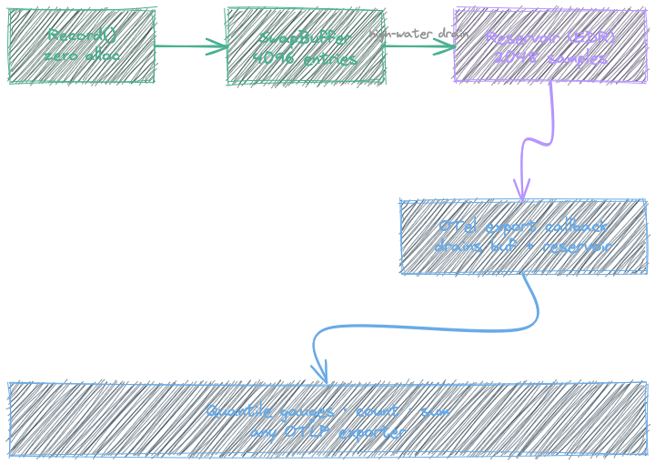

# Nanov.OpenTelemetry.Summary

A Summary metric for OpenTelemetry .NET. Computes quantiles (p95, p99, etc.) client-side and reports them as gauges through the standard OTLP pipeline.

## Why

OpenTelemetry .NET doesn't have a Summary metric type. The built-in Histogram works, but each bucket boundary generates a separate time series. With 15 buckets across many pods and short export intervals, that gets expensive fast on backends like Coralogix.

This library computes quantiles inside your app and emits them as simple gauges. Fewer series, same insight.

## Install

```bash
dotnet add package Nanov.OpenTelemetry.Summary
```

## Quick start

```csharp
using System.Diagnostics.Metrics;
using Nanov.OpenTelemetry.Summary;

var meter = new Meter("MyApp");
var summary = meter.CreateSummary("http.request.duration", unit: "ms");

// Record a value
summary.Record(42.5);

// Record with tags
summary.Record(42.5, new TagList {
    { "endpoint", "/api/users" },
    { "method", "GET" }
});
```

That's it. The summary registers observable gauges on the meter, so any configured OTel exporter picks them up automatically.

## What gets reported

By default, each summary emits:

| Metric | Type | Description |
|---|---|---|
| `{name}` | Gauge | Quantile values, tagged with `quantile="0.95"`, `quantile="0.99"` |
| `{name}.count` | Counter | Total number of observations (monotonic) |
| `{name}.sum` | Counter | Sum of all observed values |

Max is available as an opt-in:

| Metric | Type | Description |
|---|---|---|
| `{name}.max` | Gauge | Maximum observed value in the window |

## Configuration

```csharp
var summary = meter.CreateSummary("http.request.duration", "ms",
    description: "HTTP request latency",
    configure: options => options
        .WithQuantiles(0.50, 0.95, 0.99)   // default: 0.95, 0.99
        .WithMax()                          // opt-in
        .WithoutSum()                       // disable sum counter
        .WithoutCount()                     // disable count counter
        .WithBufferCapacity(8192)           // default: 4096
        .WithReservoir(sampleSize: 2048, alpha: 0.015));
```

## Timing operations

Two patterns, depending on whether you know the tags upfront.

When tags are known ahead of time, use `using`:

```csharp
using (summary.Time(new TagList { { "endpoint", "/api/users" } }))
{
    await ProcessRequest();
}
```

When tags depend on the outcome (success/failure, status code), use the manual pattern:

```csharp
var timer = summary.Time();
try
{
    await ProcessRequest();
    timer.Record(new TagList { { "status", "success" } });
}
catch
{
    timer.Record(new TagList { { "status", "failure" } });
    throw;
}
```

`Duration()` is an alias for `Time()` if you prefer that naming.

## OTel pipeline setup

Works with any OTel exporter. Just register the meter:

```csharp
builder.Services.AddOpenTelemetry()
    .WithMetrics(metrics => metrics
        .AddMeter("MyApp")
        .AddOtlpExporter());
```

## Grafana / Coralogix dashboards

### Latency overview (p95 & p99)

```promql
# p99 by endpoint, worst pod in the fleet
max by (endpoint) (http_request_duration_ms{quantile="0.99"})

# p95 by endpoint
max by (endpoint) (http_request_duration_ms{quantile="0.95"})
```

Use these as two time series on a single panel. Set the Y-axis unit to milliseconds. This gives you the tail latency per endpoint across all pods.

### Request rate

```promql
sum by (endpoint) (rate(http_request_duration_ms_count[5m]))
```

Shows requests per second per endpoint. Good as a stacked area chart to see traffic distribution.

### Average latency

```promql
sum by (endpoint) (rate(http_request_duration_ms_sum[5m]))
/
sum by (endpoint) (rate(http_request_duration_ms_count[5m]))
```

Average latency per endpoint. Useful alongside percentiles to spot whether the tail is an outlier or a systemic shift.

### SLO alerting

```promql
# Alert when p99 exceeds 500ms for 5 minutes
max by (service) (http_request_duration_ms{quantile="0.99"}) > 500
```

In Coralogix, create an alert with this query and a `for: 5m` duration. Use `max by (service)` to catch the worst pod — if any single pod breaches the SLO, you want to know.

### Suggested dashboard layout

1. **Top row**: p95 and p99 latency (line chart), request rate (stacked area)
2. **Middle row**: average latency (line chart), error rate from a separate counter if available
3. **Bottom row**: per-endpoint breakdown tables or heatmaps

Filter everything by `service` and `endpoint` variables at the top of the dashboard.

## How it works

The hot path (`Record`) writes to a lock-free swap buffer. No locks, no allocations, no contention.

A background aggregation drains the buffer into an exponentially decaying reservoir (EDR) when the buffer reaches a high-water mark. The reservoir holds a fixed number of samples (default 1028), biased toward recent observations.

At export time, the OTel collection callback drains any remaining buffer entries, computes quantiles from the reservoir, and resets it for the next window.



## Performance

Benchmarked against AppMetrics and prometheus-net on .NET 9 (ARM64):

### Single-threaded record (hot path)

| Operation | Time | Allocated |
|---|---|---|
| **Summary.Record (no tags)** | **~3 ns** | **0 B** |
| **Summary.Record (with tags)** | **~4 ns** | **0 B** |
| prometheus-net Observe (no labels) | ~30 ns | 0 B |
| prometheus-net Observe (cached child) | ~30 ns | 0 B |
| prometheus-net WithLabels + Observe | ~100 ns | 0 B |
| AppMetrics Timer.Time (no tags) | ~290 ns | 976 B |
| AppMetrics Timer.Time (with tags) | ~252 ns | 856 B |

### Key takeaways

- **~10x faster than prometheus-net**, ~100x faster than AppMetrics on the hot path
- **Zero allocations** — the swap buffer, reservoir, tag lookup, and even OTel Measurement creation are all pre-allocated or stack-based
- Lock-free writes via atomic swap buffer — no contention under concurrent load
- Quantile computation happens only at export time (every ~60s), not on every observation

## License

MIT
